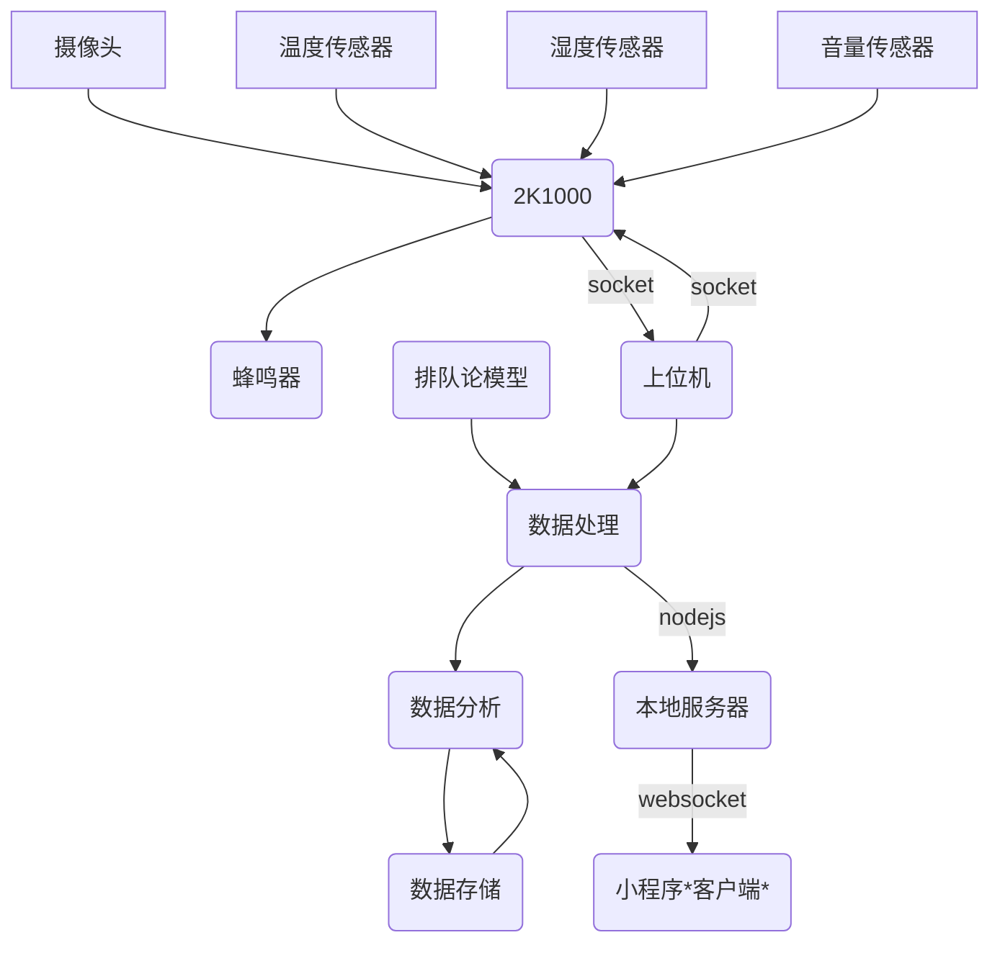

```mermaid
graph TD
A[摄像头] --> G(2K1000)
B[温度传感器]--> G(2K1000)
C[湿度传感器] --> G(2K1000)
D[音量传感器] --> G(2K1000)
    G --> M(蜂鸣器)  
    G -->|socket| H(上位机)
    H -->|socket| G
    N(排队论模型) -->I
    H -->I(数据处理)
    I -->O(数据分析)
    I -->|nodejs| J(本地服务器)
    J -->|websocket|K(小程序*客户端*)
    O -->L(数据存储)
    L -->O
```